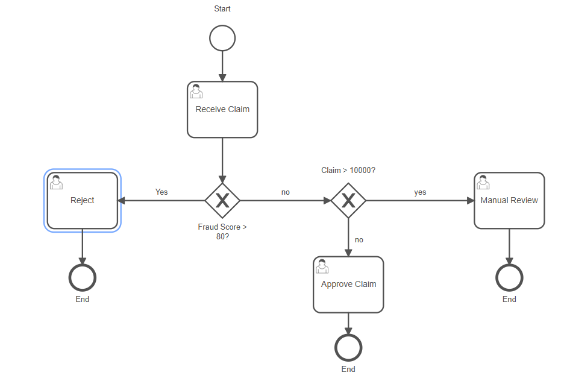

# Insurance Claim Fraud Detection System

End-to-end fraud detection pipeline combining ML and business process automation.

## Process Flow

## How it works
A Random Forest model scores incoming insurance claims for fraud risk. 
Python automatically triggers Camunda Cloud process instances via REST API,
routing each claim to Reject, Manual Review, or Approve based on the score.

## Tech Stack
- Python, scikit-learn (Random Forest)
- Camunda Cloud (BPMN 2.0 process automation)
- Streamlit (dashboard UI)
- pandas, SQLAlchemy

## Setup
1. Create a virtual environment and activate it
2. Install dependencies: `pip install -r requirements.txt`
3. Add your Camunda credentials to `.env`
4. Generate and train: `python data/generate_data.py` then `python model.py`
5. Run dashboard: `streamlit run streamlit_app.py`

## Live Demo
👉 [Try the Streamlit App](https://claim-fraud-detector-rdp9pspmu5n4fzy38j3kad.streamlit.app/)

## Full Camunda Integration
The complete Camunda Cloud integration (Python → REST API → BPMN routing) 
is shown in the demo video and available in `camunda.py`.
The BPMN process diagram is included in this repo as `diagram.bpmn`.